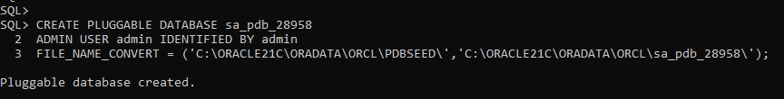
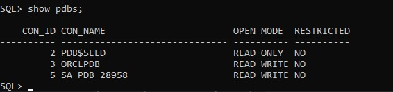
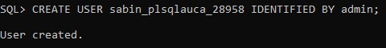
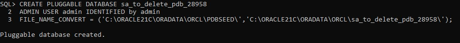
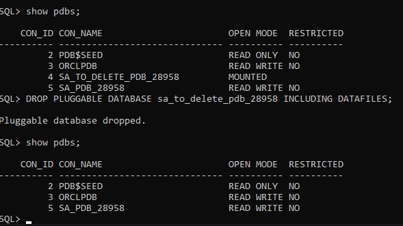
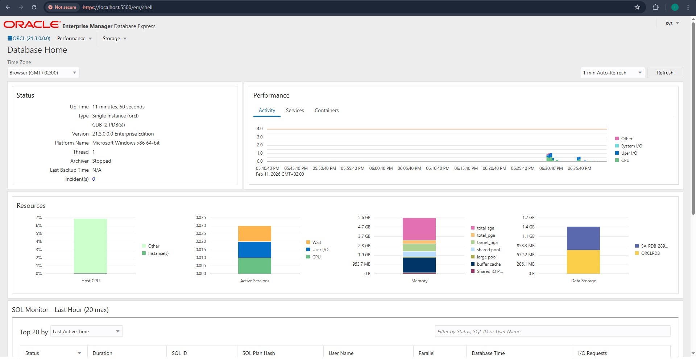

# Oracle 21c Pluggable Database Management: Oracle Multitenant Architecture 
**Student Name:** Ishimwe Sabin
**Student ID:** 28958

---

## 1. Overview of Tasks
This assignment involved a hands-on exploration of Oracle Multitenant Architecture. The core objectives included:
* Creation and configuration of a permanent Pluggable Database (PDB).
* User management and privilege assignment within a PDB.
* Management of the PDB lifecycle, including creation and complete deletion.
* Environment monitoring via Oracle Enterprise Manager (OEM).


## Task 1: Permanent PDB & User Creation.

Created a permanent PDB as well as a user. 

Inorder to create the pluggable database several steps were taken:

Before creating a pluggable database you have to first find the location in which it will be creating source to destination using:

```
SELECT name 
FROM v$datafile 
WHERE con_id = 2;
```

Now a pluggable database can be created:

```
CREATE PLUGGABLE DATABASE sa_pdb_28958 
ADMIN USER admin IDENTIFIED BY admin
FILE_NAME_CONVERT = ('C:\ORACLE21C\ORADATA\ORCL\PDBSEED', 'C:\ORACLE21C\ORADATA\ORCL\sa_pdb_28958');
```



The second step is opening the pdb for use:

```
ALTER PLUGGABLE DATABASE sa_pdb_28958 OPEN;
```
Then we use this command to check the state of the PDB:

```
show pdbs;
```



The following step involves creating a new user in our pdb.

First and foremost, we switch the our session to the created pdb:

```
ALTER SESSION SET CONTAINER = sa_pdb_28958;

```

Then we created our new user as well as give privileges to the user using the following commands:

```
CREATE USER sabin_plsqlauca_28958 IDENTIFIED BY admin;
GRANT DBA TO sabin_plsqlauca_28958;
```



## Task 2: Creating and deleting a temporary PDB

With this task, we have to first switch back to our root using:

```
ALTER SESSION SET CONTAINER = CDB$ROOT;
```

Then we create our temporary PDB using:

```
CREATE PLUGGABLE DATABASE sa_to_delete_pdb_28958
ADMIN USER admin IDENTIFIED BY admin
FILE_NAME_CONVERT = ('C:\ORACLE21C\ORADATA\ORCL\PDBSEED\', 'C:\ORACLE21C\ORADATA\ORCL\sa_to_delete_pdb_28958\');
```



Now, inorder to delete our temporary PDB we run:

```
DROP PLUGGABLE DATABASE sa_to_delete_pdb_28958 INCLUDING DATAFILES;
```

Then we check if our PDB has been deleted using:

```
show pdbs;
```



## Task 3: Oracle Entreprise Manager (OEM)

First step, we check the port for OEM using:

```
SELECT DBMS_XDB_CONFIG.GETHTTPSPORT() FROM DUAL;
```

The result should give you the port number in which is used to access the OEM through this link:

```
https//localhost:<oem port>
```

Finally you login with the system credentials.



## Challenges encountered

One of the challenges encountered with was dropping the temporary PDB where I realised I cannot drop an open database. Therefore, I switched to `CDB$ROOT` and executed `CLOSE IMMEDIATE` before running the `DROP` command.

## Final Checklist

- [x] Correct PDB names used  
- [x] User created inside the PDB  
- [x] Temporary PDB created and deleted  
- [x] OEM dashboard screenshot included  
- [x] GitHub repository is PUBLIC  
- [x] README is clear and professional  
- [x] Deadline respected
 
#
“All sources were properly cited. Implementations and analysis represent original work. No AI generated content was copied without attribution or adaptation.”
